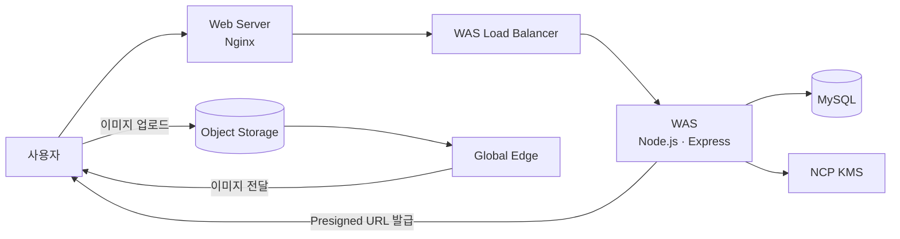

# NCP 3-Tier Architecture PoC

Naver Cloud에서 웹, 서버, 데이터베이스를 나눠 직접 구성해 본 현장실습 프로젝트임.

- 기간: 2026.01.29 ~ 2026.02.11
- 구분: 클라우드스퀘어 현장실습 개인 프로젝트
- 담당: 구조 설계, 개발, 보안 설정과 배포
- 기술: Naver Cloud, Nginx, Node.js, Express, MySQL

## 만든 구조

| 구간 | 사용한 구성 | 맡긴 역할 |
| --- | --- | --- |
| Web | Nginx | 정적 페이지 제공과 API 요청 전달 |
| WAS | Node.js, Express, Load Balancer | 로그인, 게시판과 업로드 API 처리 |
| DB | MySQL | 회원과 게시글 데이터 저장 |
| 파일 | Object Storage, Global Edge | 이미지 저장과 전달 |
| 보안 | bcrypt, JWT, NCP KMS | 비밀번호 해시, 로그인 인증과 글 내용 암호화 |

## 만든 기능

- 회원가입, 로그인과 JWT 인증을 구현했음.
- 이메일 인증을 이용한 비밀번호 찾기를 만들었음.
- 글 작성과 사진 업로드가 되는 게시판을 구현했음.
- 사진은 Object Storage에 저장하고 정적 파일은 Global Edge로 전달했음.
- 게시글 내용은 NCP KMS로 암호화한 뒤 DB에 저장하게 만들었음.
- 중요한 값은 코드에 직접 적지 않고 환경 변수로 분리했음.
- GitHub Actions를 이용해 배포 과정을 정리했음.

## 진행 결과

- 현장실습에서 계획한 PoC를 완성했음.
- 각 서버가 어떤 순서로 연결되는지 직접 구성하며 확인했음.
- 실습 종료 후 코드를 GitHub에 백업하고 민감한 값은 제거했음.
